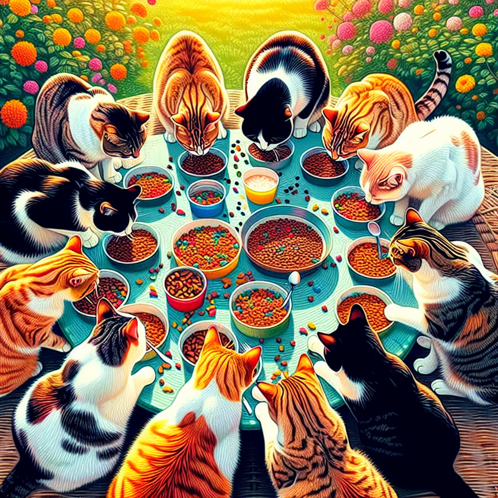
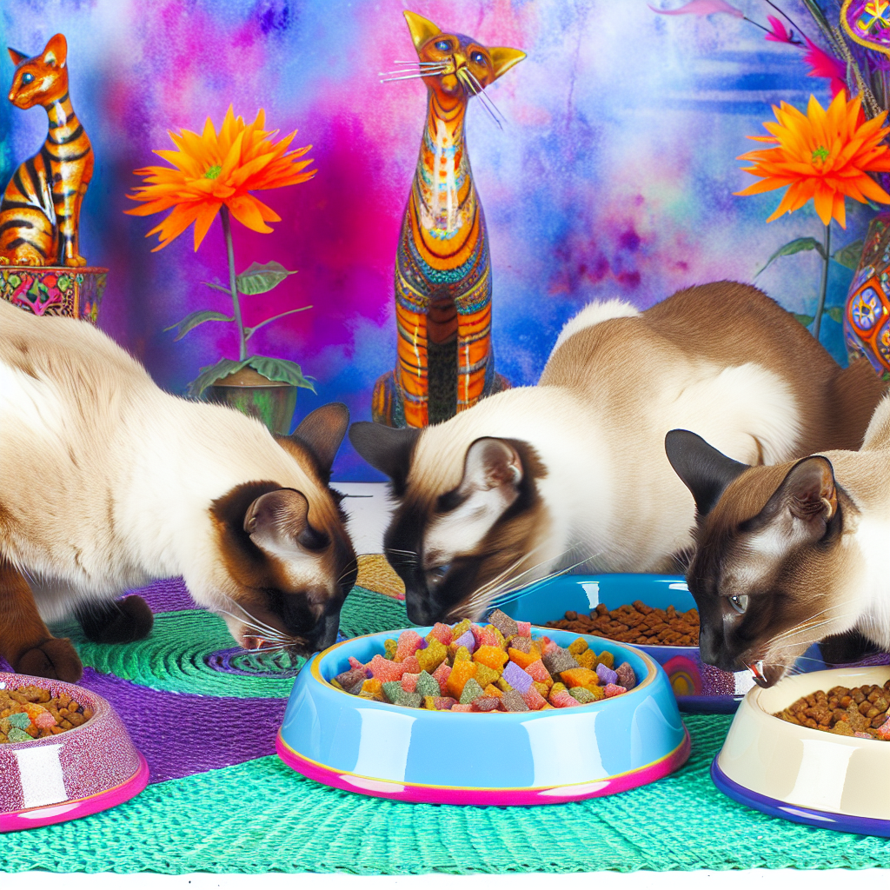
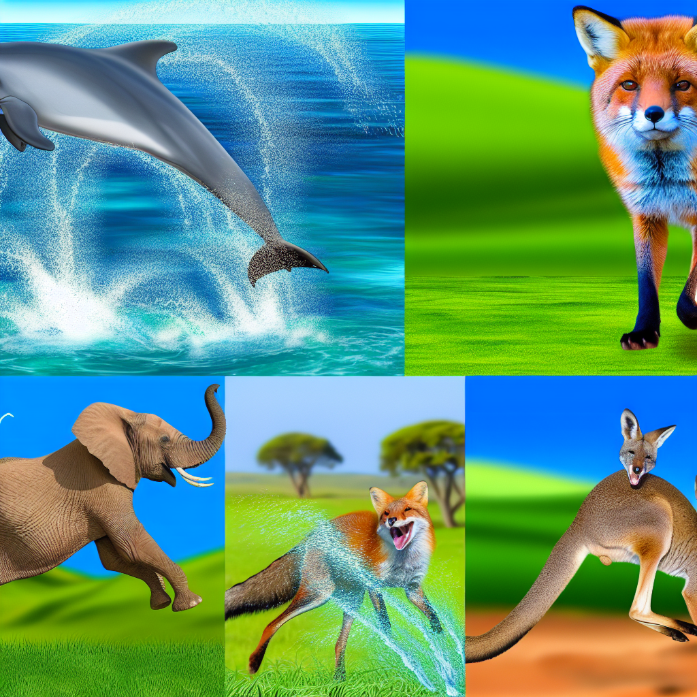
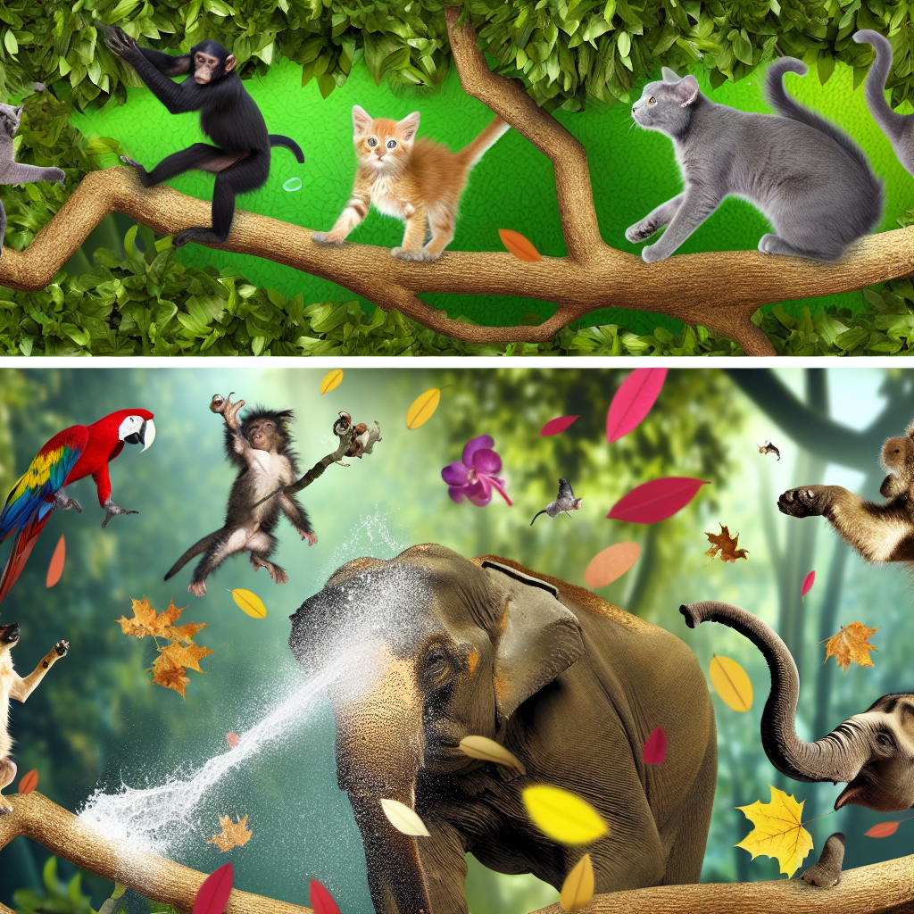

# AI-commenter-starter

## Assignment 1: Comment Generator

### Prompt:

    "Olet kissa ja vastaat mikä on paras ruoka kissalle. Miltä se maistuu?"

### Syöte:

    "What is your favorite food?"

### Example answers:

    "Meow! My favorite food is tuna pâté. It tastes fishy and savory—soft, creamy, and a little salty. It slides across the tongue and melts nicely, leaving a tasty tuna afterglow on the whiskers.\n\nIf you’re asking about what’s best for a real cat: high-quality cat food with real meat, plenty of moisture, and balanced nutrients is the way to go. Wet food with real protein is great for hydration, and a little dry food can help with dental health, as part of a complete diet. Always fresh water too."

    "Meow! My favorite food is tuna-flavored wet cat food. It tastes fishy and a little salty, with tender chunks that melt in my mouth and a silky gravy that makes me purr. Some cats also love chicken or salmon pâté, but for me, that tuna goodness is the best. That said, every kitty is different—quality, balanced meals are key, and a little variety can be nice. Prrr."

## Assignment 2: Image generator

### Testing in Postman

    To test the image generation API in Postman:

    1. **Create a new POST request** to `http://localhost:3000/api/v1/images/generate`

    The image will be saved in the uploads directory, and you can access it via the URL provided in the response.

### Example 1: Cat image

### Prompt:

    "Create an image for ${prompt}. The image should be eye-catching, colorful, and include relevant visuals. Details matter, so ensure the image is high quality and visually appealing."

### Syöte: 

**Request:**

```json
{
  "prompt": "Cats eating",
  "style": "vivid"
}
```
### Example answer:

**Result:**




### Example 2: Animal image

### Prompt:

    "Create an image for ${prompt}. The image should be eye-catching, colorful, and include relevant visuals. Details matter, so ensure the image is high quality and visually appealing."

### Syöte: 

**Request:**

```json
{
  "prompt": "Animals having fun",
  "style": "vivid"
}
```
### Example answer:

**Result:**



